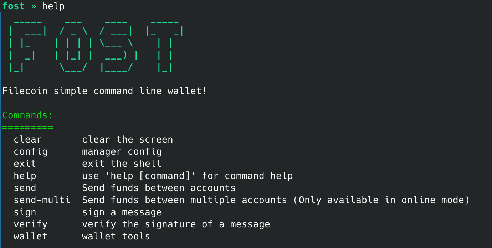
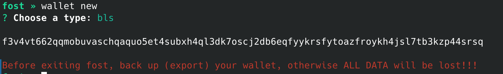
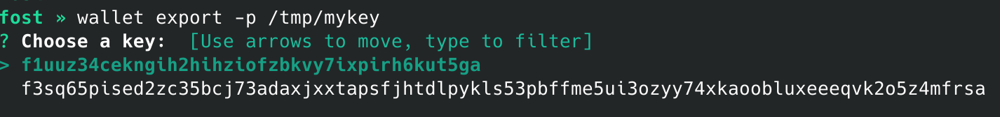
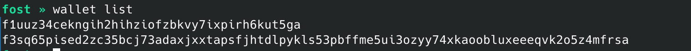
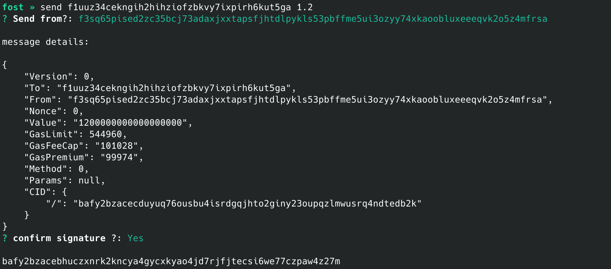
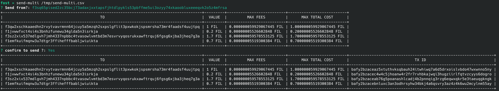

# Fost

Filecoin simple command line wallet.

**Warning:** 

* Your private key will be stored in memory and will not be sent anywhere.
* When exiting the fost interactive mode, **ALL DATA** will be deleted, including the private key.

**Use it at your own risk!** ☠️

## Dependencies

Fost is built on top of [Lotus](https://github.com/filecoin-project/lotus), you need to install the dependencies [required by Lotus](https://github.com/filecoin-project/lotus#basic-build-instructions).

* Linux: https://docs.filecoin.io/get-started/lotus/installation/#building-from-source
* MacOS: https://docs.filecoin.io/get-started/lotus/installation/#build-from-source

## Build

```shell
git clone https://github.com/strahe/fost.git
cd fost
make
```

## Usage

### Enter interactive mode

```shell

## Enter online interactive mode with default config

./fost 

## Enter offline interactive mode (For professional users)

./fost --offline

## Specify Lotus RPC (default: https://api.node.glif.io/rpc/v0)
## Lotus RPC is only used to query the chain status, your private key will not be sent anywhere.

./fost -r https://api.node.glif.io
```

### Interactive mode



### create new key
> Warning: When creating a key in interactive mode, you must export the private key before using it.



### import keys
> Your private key will only be stored in local memory.


### export keys
> Export the private key to a file



### list keys



### send funds between accounts
> Send funds to an account and return the transaction ID



### Send funds between multiple accounts

Use csv file


Use Text file

```shell
$ cat send-multi.txt
 
f3qw2xschkaaedhn2rvytvavrmnn64jcuy5a5mzqh2sxpslgflit3pxwkokjspsmrsha73mr4faadsf4uujtpq,1
f1jvwwfxct4si4s3bnhzfunewu34glda5n3isrkja,0.2
f3sz2xiv537mdlgvh7jmh4337npbbc4tvasowlvmtbd3m7esvrvyqosrukxawftrquj6fgsg6xjba3jheq7g3a,1.7
f1emfkuifmqnw3u7dtgr3ffihefffbabljwiuikta,0.7
```


