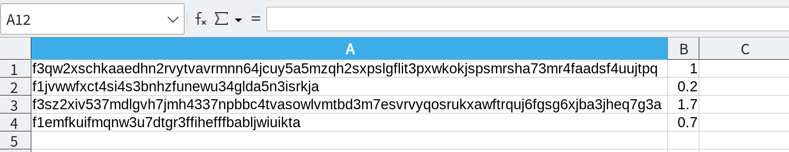

# Fost

Filecoin simple command line wallet.

**Warning:** 

* Your private key will be stored in memory and will not be sent anywhere.
* When exiting the fost interactive mode, **ALL DATA** will be deleted, including the private key.

**Use it at your own risk!** ☠️

## Dependencies

Fost is built on top of [Lotus](https://github.com/filecoin-project/lotus), you need to install the dependencies [required by Lotus](https://github.com/filecoin-project/lotus#basic-build-instructions).

* Linux: https://docs.filecoin.io/get-started/lotus/installation/#building-from-source
* MacOS: https://docs.filecoin.io/get-started/lotus/installation/#build-from-source

## Build

```shell
git clone https://github.com/strahe/fost.git
cd fost
make
```

## Usage

### Enter interactive mode

```shell

## Enter online interactive mode with default config

./fost 

## Enter offline interactive mode (For professional users)

./fost --offline

## Specify Lotus RPC (default: https://api.node.glif.io/rpc/v0)
## Lotus RPC is only used to query the chain status, your private key will not be sent anywhere.

./fost -r https://api.node.glif.io
```

### Interactive mode

```shell
fost » help
  _____    ___    ____    _____
 |  ___|  / _ \  / ___|  |_   _|
 | |_    | | | | \___ \    | |
 |  _|   | |_| |  ___) |   | |
 |_|      \___/  |____/    |_|

Filecoin simple command line wallet!

Commands:
=========
  clear       clear the screen
  config      manager config
  exit        exit the shell
  help        use 'help [command]' for command help
  send        Send funds between accounts
  send-multi  Send funds between multiple accounts (Only available in online mode)
  sign        sign a message
  verify      verify the signature of a message
  wallet      wallet tools

```

### create new key

```shell
## Warning: When creating a key in interactive mode, you must export the private key before using it.

fost » wallet new
? Choose a type: secp256k1

f1kq4ehjgfwxa53pipvsgx6nzzecwbeqld7cb2o4a

Before exiting fost, back up (export) your wallet, otherwise ALL DATA will be lost!!!
```

### import keys

```shell
## Your private key will only be stored in local memory.

fost » wallet import
? Please type private key ****************************************************************************************************************************************************************

imported key f1uuz34cekngih2hihziofzbkvy7ixpirh6kut5ga successfully!
```

### export keys

```shell
## Export the private key to a file

fost » wallet export -p /tmp/mykey
? Choose a key: f1kq4ehjgfwxa53pipvsgx6nzzecwbeqld7cb2o4a
write private key to: /tmp/mykey

Keep your private key safe, the private key is everything!!!

```

### list keys

```shell
fost » wallet list
f1kq4ehjgfwxa53pipvsgx6nzzecwbeqld7cb2o4a
f1uuz34cekngih2hihziofzbkvy7ixpirh6kut5ga

```

### send funds between accounts

```shell
## Send funds to an account and return the transaction ID

fost » send f1uuz34cekngih2hihziofzbkvy7ixpirh6kut5ga 1.2
? Send from?: f3sq65pised2zc35bcj73adaxjxxtapsfjhtdlpykls53pbffme5ui3ozyy74xkaoobluxeeeqvk2o5z4mfrsa

message details:

{
    "Version": 0,
    "To": "f1uuz34cekngih2hihziofzbkvy7ixpirh6kut5ga",
    "From": "f3sq65pised2zc35bcj73adaxjxxtapsfjhtdlpykls53pbffme5ui3ozyy74xkaoobluxeeeqvk2o5z4mfrsa",
    "Nonce": 0,
    "Value": "1200000000000000000",
    "GasLimit": 544960,
    "GasFeeCap": "99983",
    "GasPremium": "98929",
    "Method": 0,
    "Params": null,
    "CID": {
        "/": "bafy2bzacedoivyr73osrgujebqdmgjpbojufk7grzh33mbv6ba63g7imbwqpg"
    }
}
? confirm signature ?: Yes

bafy2bzacecpcqjp3r3xbvjlg4n2ptcrajmz37dly6g55xoc636tgks7lj5f7w
```

### Send funds between multiple accounts

Use csv file



Use Text file

```shell
$ cat send-multi.txt
 
f3qw2xschkaaedhn2rvytvavrmnn64jcuy5a5mzqh2sxpslgflit3pxwkokjspsmrsha73mr4faadsf4uujtpq,1
f1jvwwfxct4si4s3bnhzfunewu34glda5n3isrkja,0.2
f3sz2xiv537mdlgvh7jmh4337npbbc4tvasowlvmtbd3m7esvrvyqosrukxawftrquj6fgsg6xjba3jheq7g3a,1.7
f1emfkuifmqnw3u7dtgr3ffihefffbabljwiuikta,0.7
```

```shell
fost » send-multi /tmp/send-multi.csv

? Send from?: f3sq65pised2zc35bcj73adaxjxxtapsfjhtdlpykls53pbffme5ui3ozyy74xkaoobluxeeeqvk2o5z4mfrsa

+----------------------------------------------------------------------------------------+---------+--------------------------+--------------------------+
|                                           TO                                           |  VALUE  |         MAX FEES         |      MAX TOTAL COST      |
+----------------------------------------------------------------------------------------+---------+--------------------------+--------------------------+
| f3qw2xschkaaedhn2rvytvavrmnn64jcuy5a5mzqh2sxpslgflit3pxwkokjspsmrsha73mr4faadsf4uujtpq | 1 FIL   | 0.00000005949506914 FIL  | 1.00000005949506914 FIL  |
| f1jvwwfxct4si4s3bnhzfunewu34glda5n3isrkja                                              | 0.2 FIL | 0.00000005505839872 FIL  | 0.20000005505839872 FIL  |
| f3sz2xiv537mdlgvh7jmh4337npbbc4tvasowlvmtbd3m7esvrvyqosrukxawftrquj6fgsg6xjba3jheq7g3a | 1.7 FIL | 0.000000059627104095 FIL | 1.700000059627104095 FIL |
| f1emfkuifmqnw3u7dtgr3ffihefffbabljwiuikta                                              | 0.7 FIL | 0.00000005480771712 FIL  | 0.70000005480771712 FIL  |
+----------------------------------------------------------------------------------------+---------+--------------------------+--------------------------+

? confirm to send ?: Yes

+----------------------------------------------------------------------------------------+---------+--------------------------+--------------------------+----------------------------------------------------------------+
|                                           TO                                           |  VALUE  |         MAX FEES         |      MAX TOTAL COST      |                             TX ID                              |
+----------------------------------------------------------------------------------------+---------+--------------------------+--------------------------+----------------------------------------------------------------+
| f3qw2xschkaaedhn2rvytvavrmnn64jcuy5a5mzqh2sxpslgflit3pxwkokjspsmrsha73mr4faadsf4uujtpq | 1 FIL   | 0.00000005949506914 FIL  | 1.00000005949506914 FIL  | bafy2bzacedq3famy7bygurpxt352qkhubloeqpw3am52o4rfjnohtljkafuok |
| f1jvwwfxct4si4s3bnhzfunewu34glda5n3isrkja                                              | 0.2 FIL | 0.00000005505839872 FIL  | 0.20000005505839872 FIL  | bafy2bzacec32xmwbicei72aveppazsvlti2weutqdhxm4zskrccrkgocw5iem |
| f3sz2xiv537mdlgvh7jmh4337npbbc4tvasowlvmtbd3m7esvrvyqosrukxawftrquj6fgsg6xjba3jheq7g3a | 1.7 FIL | 0.000000059627104095 FIL | 1.700000059627104095 FIL | bafy2bzacedmtjlu3fifwcu26us7nka2ruhktexuwmjmtgtgi4o5idzinmu5h4 |
| f1emfkuifmqnw3u7dtgr3ffihefffbabljwiuikta                                              | 0.7 FIL | 0.00000005480771712 FIL  | 0.70000005480771712 FIL  | bafy2bzacebbqsgrwck7dnlcyfnjrnueycznad2fkh3muf3ewcuajawjukfybm |
+----------------------------------------------------------------------------------------+---------+--------------------------+--------------------------+----------------------------------------------------------------+

```
